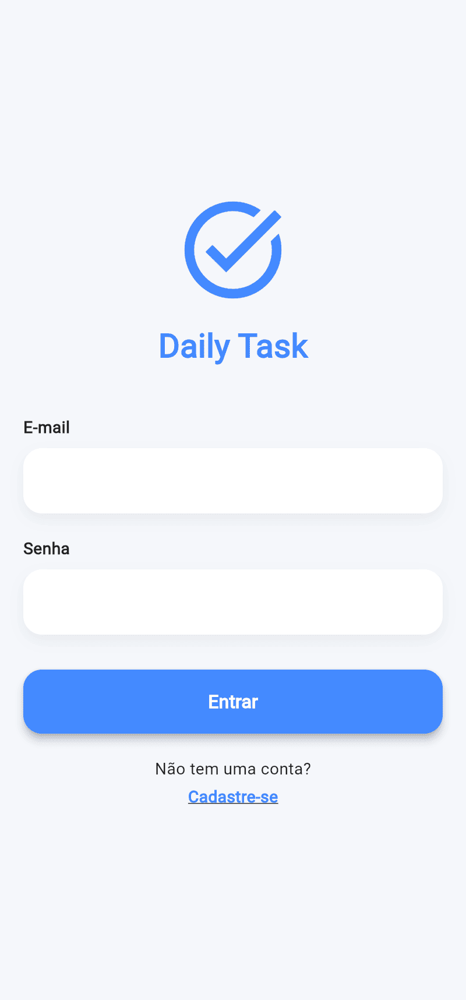
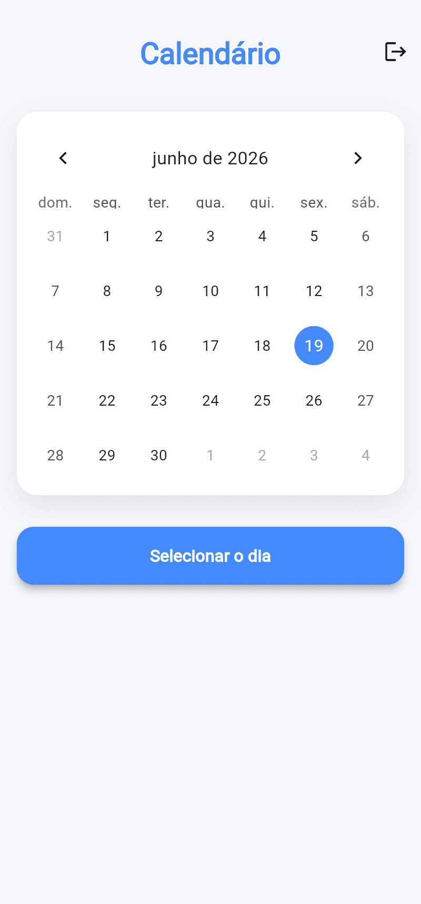
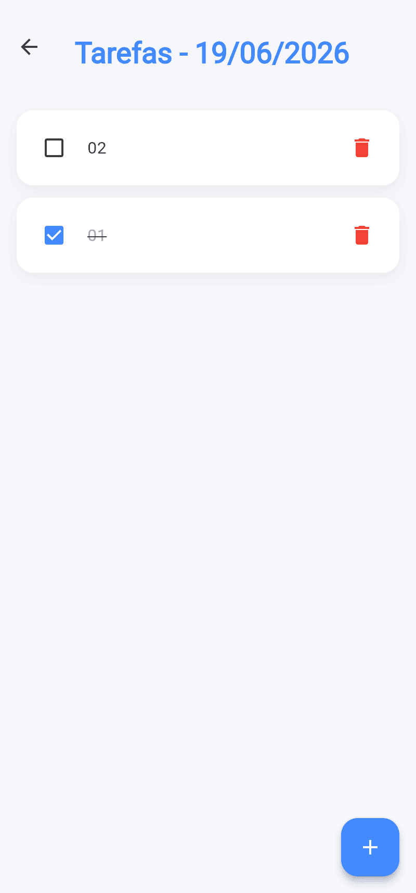
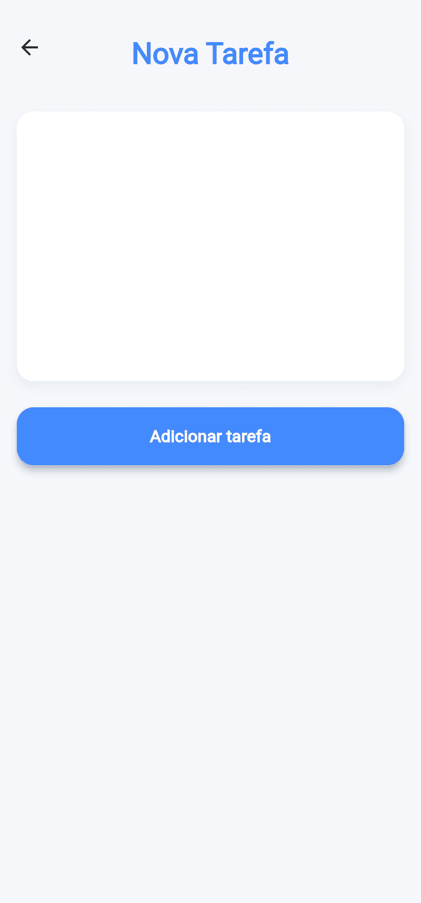

# Daily Task - Aplicativo de Tarefas em Flutter

## Disciplina
Desenvolvimento para Dispositivos Móveis

## Descrição

O **Daily Task** é um aplicativo desenvolvido em Flutter para gerenciamento de tarefas diárias. O sistema permite que o usuário realize cadastro e login, selecione datas em um calendário e organize tarefas por dia.

As tarefas podem ser adicionadas, marcadas como concluídas e removidas. A aplicação organiza automaticamente as tarefas, exibindo primeiro as pendentes e depois as concluídas, ambas em ordem alfabética.

## Funcionalidades

- Cadastro e login de usuários
- Autenticação com Firebase
- Seleção de datas via calendário
- Adição de tarefas por dia
- Marcar tarefas como concluídas
- Remover tarefas
- Organização automática das tarefas:
  - Pendentes primeiro
  - Concluídas depois
  - Ordem alfabética
- Atualização em tempo real com Stream (Cloud Firestore)

## Estrutura do Projeto

```bash
lib/
├── models/
│   └── task.dart
│
├── screens/
│   ├── add_task_screen.dart
│   ├── calendar_screen.dart
│   ├── login_screen.dart
│   ├── signup_screen.dart
│   └── tasks_screen.dart
│
├── services/
│   ├── auth_service.dart
│   └── task_service.dart
│
├── theme/
│   ├── app_colors.dart
│   └── app_theme.dart
│
├── widgets/
│   ├── add_button.dart
│   ├── app_logo.dart
│   ├── custom_button.dart
│   ├── empty_state.dart
│   └── task_card.dart
│
└── main.dart
```


## Screenshots do Aplicativo

<table>
  <tr>
    <td align="center"><b>Login</b></td>
    <td align="center"><b>Calendário</b></td>
  </tr>
  <tr>
    <td></td>
    <td></td>
  </tr>
</table>

<br/>

<table>
  <tr>
    <td align="center"><b>Tarefas</b></td>
    <td align="center"><b>Adicionar Tarefa</b></td>
  </tr>
  <tr>
    <td></td>
    <td></td>
  </tr>
</table>

## Tecnologias Utilizadas

- Flutter
- Firebase Authentication
- Cloud Firestore

## Arquitetura

O projeto segue uma arquitetura baseada em separação de responsabilidades:

- Models: estrutura de dados
- Services: regras de negócio e comunicação com backend
- Screens: interface do usuário
- Widgets: componentes reutilizáveis
- Theme: estilo visual do aplicativo

## Autenticação

O sistema utiliza Firebase Authentication para:

- Cadastro de usuários
- Login
- Logout
- Controle de sessão

## Conclusão

O projeto tem como objetivo demonstrar conhecimentos em desenvolvimento mobile com Flutter, incluindo navegação entre telas, manipulação de estado, integração com Firebase e organização de código.

Foi aplicada uma arquitetura modular para facilitar manutenção e escalabilidade.
